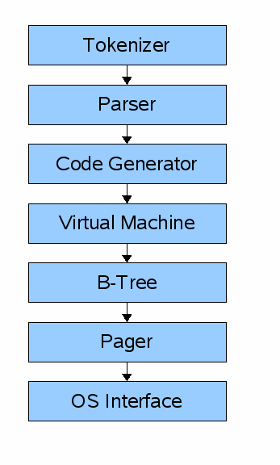

# 简介和设置REPL

注： 本文翻译参考自[db_tutorial](https://cstack.github.io/db_tutorial/parts/part1.html).

作为一名Web开发人员，我每天都在工作中使用关系数据库，但它们对我来说是一个黑匣子。我有一些问题：

- 数据以什么格式保存？（在内存和磁盘上）
- 它何时从内存移动到磁盘？
- 为什么每个表只能有一个主键？
- 回滚事务如何工作？
- 索引的格式是什么样的？
- 什么进行全表扫描？如何进行全表扫描？
- 预处理语句以什么格式保存？

为了弄清楚事情，我们将从头开始编写一个数据库。它是以sqlite为模型的，因为它被设计得很小，比MySQL或PostgreSQL的功能更少，我们更容易理解它。而且sqlite的整个数据库存储在一个文件中！

## sqlite sqlite

sqlite网站上有很多关于sqlite内部的[文档](https://www.sqlite.org/arch.html)，另外还有一份SQLite数据库系统：设计和实现的[文档](https://play.google.com/store/books/details?id=9Z6IQQnX1JEC&pli=1)(该文档可能无法访问)。

sqlite的架构大致如下：



查询通过组件链来检索或修改数据。前端包括：

- tokenizer 分词器
- parser 解析器
- code generator 代码生成器

前端的输入是 SQL 查询。输出是SQLite虚拟机字节码（本质上是一个可以在数据库上运行的编译程序）。

后端包括：

- virtual machine 虚拟机
- B-tree B树
- pager 页
- os interface 界面

虚拟机将前端生成的字节码作为指令。然后，它可以对一个或多个表或索引执行操作，每个表或索引都存储在称为 B 树的数据结构中。VM 本质上是关于字节码指令类型的很大的switch语句。

每个 B 树由许多节点组成。每个节点的长度为一页。B树可以从磁盘检索页面，也可以通过向pager发出命令将其保存回磁盘。

pager接收用于读取或写入数据页的命令。它负责在数据库文件中以适当的偏移量读取/写入。它还在内存中保留最近访问的页面的缓存，并确定何时需要将这些页面写回磁盘。

操作系统接口是因编译 sqlite 所针对的操作系统而异的层。在本教程中，我不打算支持多个平台。

千里之行始于足下，所以让我们从更直接的东西开始：REPL。

## 制作一个简单的REPL

当您从命令行启动 Sqlite 时，它会启动读取-执行-打印循环：

```shell
~ sqlite3
SQLite version 3.16.0 2016-11-04 19:09:39
Enter ".help" for usage hints.
Connected to a transient in-memory database.
Use ".open FILENAME" to reopen on a persistent database.
sqlite> create table users (id int, username varchar(255), email varchar(255));
sqlite> .tables
users
sqlite> .exit
~
```

为此，我们的 main 函数将有一个无限循环，用于打印提示，获取一行输入，然后处理该行输入：

```c
int main(int argc, char* argv[]) {
  InputBuffer* input_buffer = new_input_buffer();
  while (true) {
    print_prompt();
    read_input(input_buffer);

    if (strcmp(input_buffer->buffer, ".exit") == 0) {
      close_input_buffer(input_buffer);
      exit(EXIT_SUCCESS);
    } else {
      printf("Unrecognized command '%s'.\n", input_buffer->buffer);
    }
  }
}
```

我们将 InputBuffer 定义为我们需要存储以与 getline（） 交互的状态的小包装器。（稍后会详细介绍）

```c
typedef struct {
  char* buffer;
  size_t buffer_length;
  ssize_t input_length;
} InputBuffer;

InputBuffer* new_input_buffer() {
  InputBuffer* input_buffer = (InputBuffer*)malloc(sizeof(InputBuffer));
  input_buffer->buffer = NULL;
  input_buffer->buffer_length = 0;
  input_buffer->input_length = 0;

  return input_buffer;
}
```

接下来， print_prompt() 向用户打印提示。我们在读取每行输入之前执行此操作。

```c
void print_prompt() {
     printf("db > "); 
}
```

要读取输入行，请使用 getline（）：

```c
ssize_t getline(char **lineptr, size_t *n, FILE *stream);
```
- lineptr ：指向我们用来指向包含读取行的缓冲区的变量的指针。如果它设置为 NULL ，则它被 getline 错误定位，因此即使命令失败，用户也应释放它。

- stream ：要从中读取的输入流。我们将从标准输入中读取

- return value ：读取的字节数，可能小于缓冲区的大小。

我们告诉 getline 将读取行存储在 input_buffer->buffer 中，将分配的缓冲区的大小存储在 input_buffer->buffer_length 中。我们将返回值存储在 input_buffer->input_length 中。

buffer 以 null 开头，因此 getline 分配足够的内存来保存输入行并使其指向 buffer 。

```c
void read_input(InputBuffer* input_buffer) {
#ifdef _WIN32
  size_t len;
  fgets(input_buffer->buffer, MAX_INPUT_BUFFER, stdin);
  len = strlen(input_buffer->buffer);
  if (len <= 0) {
    printf("Error reading input\n");
    exit(EXIT_FAILURE);
  }
  input_buffer->input_length = len - 1;
  input_buffer->buffer[len - 1] = '\0';
#else
  
  ssize_t bytes_read =
      getline(&(input_buffer->buffer), &(input_buffer->buffer_length), stdin);

  if (bytes_read <= 0) {
    printf("Error reading input\n");
    exit(EXIT_FAILURE);
  }

  // Ignore trailing newline
  input_buffer->input_length = bytes_read - 1;
  input_buffer->buffer[bytes_read - 1] = 0;
#endif
}
```
注意：windows下没有getline函数，这里使用fgets来代替。

现在定义一个函数来释放分配给 InputBuffer * 实例和相应结构的 buffer 元素的内存（ getline 在read_input中为 input_buffer->buffer分配内存）。

```c
void close_input_buffer(InputBuffer* input_buffer) {
    free(input_buffer->buffer);
    free(input_buffer);
}
```

最后，我们解析并执行命令。现在只有一个可识别的命令： .exit ，它终止程序。否则，我们将打印错误消息并继续循环。

```c
if (strcmp(input_buffer->buffer, ".exit") == 0) {
  close_input_buffer(input_buffer);
  exit(EXIT_SUCCESS);
} else {
  printf("Unrecognized command '%s'.\n", input_buffer->buffer);
}
```

以下部分是完整程序代码：

```c
#include <stdbool.h>
#include <stdio.h>
#include <stdlib.h>
#include <string.h>

#ifdef _WIN32
#define MAX_INPUT_BUFFER 4096
#endif

typedef struct {
  char* buffer;
  size_t buffer_length;
  ssize_t input_length;
} InputBuffer;

InputBuffer* new_input_buffer() {
  InputBuffer* input_buffer = malloc(sizeof(InputBuffer));
  #ifdef _WIN32
  input_buffer->buffer = malloc(MAX_INPUT_BUFFER);
  #else
  input_buffer->buffer = NULL;
  #endif
  input_buffer->buffer_length = 0;
  input_buffer->input_length = 0;

  return input_buffer;
}

void print_prompt() { printf("db > "); }

void read_input(InputBuffer* input_buffer) {
#ifdef _WIN32
  size_t len;
  fgets(input_buffer->buffer, MAX_INPUT_BUFFER, stdin);
  len = strlen(input_buffer->buffer);
  if (len <= 0) {
    printf("Error reading input\n");
    exit(EXIT_FAILURE);
  }
  input_buffer->input_length = len - 1;
  input_buffer->buffer[len - 1] = '\0';
#else
  
  ssize_t bytes_read =
      getline(&(input_buffer->buffer), &(input_buffer->buffer_length), stdin);

  if (bytes_read <= 0) {
    printf("Error reading input\n");
    exit(EXIT_FAILURE);
  }

  // Ignore trailing newline
  input_buffer->input_length = bytes_read - 1;
  input_buffer->buffer[bytes_read - 1] = 0;
#endif
}

void close_input_buffer(InputBuffer* input_buffer) {
    free(input_buffer->buffer);
    free(input_buffer);
}

int main(int argc, char* argv[]) {
  InputBuffer* input_buffer = new_input_buffer();
  while (true) {
    print_prompt();
    read_input(input_buffer);

    if (strcmp(input_buffer->buffer, ".exit") == 0) {
      close_input_buffer(input_buffer);
      exit(EXIT_SUCCESS);
    } else {
      printf("Unrecognized command '%s'.\n", input_buffer->buffer);
    }
  }
}
```

对应的Makefile文件如下：

```makefile
all:
	gcc -g -O0 main.c -o db
clean:
	rm -rf db
```

执行如下命令编译并执行，编译过程及执行结果如下：

```shell
PS D:\code\db021\code> make
gcc -g -O0 main.c -o db
PS D:\code\db021\code> .\db.exe
db > .help
Unrecognized command '.help'.
db > .exit
PS D:\code\db021\code>
```
[下一篇](./part2.md)[世界上最简单的编译器和虚拟机](./part1.md)