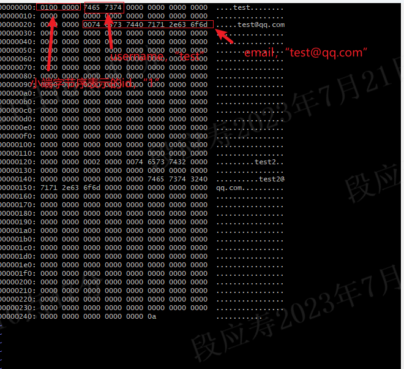

# 持久化到磁盘

我们的数据库允许您插入记录并读回记录，但前提是您保持程序运行。如果您终止程序并重新启动它，则所有记录都将消失。

与 sqlite 一样，我们将通过将整个数据库保存到文件中来持久化记录。

我们已经通过将行序列化为页面大小的内存块来做到这一点。为了增加持久性，我们可以简单地将这些内存块写入文件，并在下次程序启动时将它们读回内存中。

为了简化此操作，我们将创建一个称为抽象的寻址器。我们向pager询问 页码 x ，pager会给我们一个内存块。它首先在其缓存中查找，在缓存未命中时，它会将数据从磁盘复制到内存中（通过读取数据库文件）。

如下图所示，我们的数据库架构和sqlite的映射关系如下：


pager访问页面缓存和文件。Table 对象通过pager发出页面请求：

```c
 typedef struct {
-  uint32_t num_rows;
+  FILE *file_descriptor;
+  uint32_t file_length;
   void* pages[TABLE_MAX_PAGES];
+} Pager;
+
+typedef struct {
+  uint32_t num_rows;
+  Pager* pager;
 } Table;
```

我重命名为 new_table() db_open() ，因为它现在具有打开数据库连接的效果。打开一个连接意味着：

- 打开数据库文件

- 初始化pager数据结构

- 初始化表数据结构

```c
-void free_table(Table* table) {
-    for (int i = 0; table->pages[i]; i++) {
-       free(table->pages[i]);
-    }
-    free(table);
+Table* db_open(const char* filename) {
+  Pager* pager = pager_open(filename);
+  uint32_t num_rows = pager->file_length / ROW_SIZE;
+  Table* table = (Table*)malloc(sizeof(Table));
+  table->pager = pager;
+  table->num_rows = num_rows;
+
+  return table;
 }
```

db_open() 调用 pager_open() 打开数据库文件并跟踪其大小。它还将页面缓存初始化为所有 NULL。

```c
-Table* new_table() {
-  Table* table = (Table*)malloc(sizeof(Table));
-  table->num_rows = 0;
+Pager* pager_open(const char* filename) {
+  FILE* fd = fopen(filename, "rw+");
+  if (fd == NULL) {
+    fd = fopen(filename, "w+");
+    if (fd == NULL) {
+      printf("Unable to open file\n");
+      exit(EXIT_FAILURE);
+    }
+  }
+  fseek(fd, 0, SEEK_END);
+  off_t file_length = ftell(fd);
+  Pager* pager = malloc(sizeof(Pager));
+  pager->file_descriptor = fd;
+  pager->file_length = file_length;
+
   for (uint32_t i = 0; i < TABLE_MAX_PAGES; i++) {
-     table->pages[i] = NULL;
+    pager->pages[i] = NULL;
   }
-  return table;
+
+  return pager;
 }
```

按照我们的新抽象，我们将获取页面的逻辑移动到它自己的方法中：

```c
void* row_slot(Table* table, uint32_t row_num) {
   uint32_t page_num = row_num / ROWS_PER_PAGE;
-  void* page = table->pages[page_num];
-  if (page == NULL) {
-    // Allocate memory only when we try to access page
-    page = table->pages[page_num] = malloc(PAGE_SIZE);
-  }
+  void* page = get_page(table->pager, page_num);
+
   uint32_t row_offset = row_num % ROWS_PER_PAGE;
   uint32_t byte_offset = row_offset * ROW_SIZE;
+
   return page + byte_offset;
 }
```

该方法 get_page() 具有处理缓存未命中的逻辑。我们假设页面一个接一个地保存在数据库文件中：第 0 页位于偏移量 0，第 1 页位于偏移量 4096，第 2 页位于偏移量 8192，依此类推。如果请求的页面位于文件边界之外，我们知道它应该是空白的，所以我们只是分配一些内存并返回它。稍后将缓存刷新到磁盘时，该页面将添加到文件中。

```c

+void* get_page(Pager* pager, uint32_t page_num) {
+  Row *row = NULL;
+  if (page_num > TABLE_MAX_PAGES) {
+    printf("Tried to fetch page number out of bounds. %d > %d\n", page_num,
+           TABLE_MAX_PAGES);
+    exit(EXIT_FAILURE);
+  }
+
+  if (pager->pages[page_num] == NULL) {
+    // Cache miss. Allocate memory and load from file.
+    void* page = malloc(PAGE_SIZE);
+    memset(page, 0, PAGE_SIZE);
+    uint32_t num_pages = pager->file_length / PAGE_SIZE;
+
+    // We might save a partial page at the end of the file
+    if (pager->file_length % PAGE_SIZE) {
+      num_pages = 1;
+    }
+
+    if (page_num <= num_pages) {
+      fseek(pager->file_descriptor, page_num * PAGE_SIZE, SEEK_SET);
+      ssize_t bytes_read = fread(page, PAGE_SIZE, 1, pager->file_descriptor);
+      row = (Row*)page;
+      if (bytes_read == -1) {
+        printf("Error reading file: %d\n", errno);
+        exit(EXIT_FAILURE);
+      }
+    }
+
+    pager->pages[page_num] = page;
+  }
+
+  return pager->pages[page_num];
+}
```
现在，我们将等待将缓存刷新到磁盘，直到用户关闭与数据库的连接。当用户退出时，我们将调用一个名为 db_close() 的新方法 ，它负责如下操作：

- 将页面缓存刷新到磁盘

- 关闭数据库文件

- 释放寻址器和数据结构的内存

```c
+void db_close(Table* table) {
+  Pager* pager = table->pager;
+  uint32_t num_full_pages = table->num_rows / ROWS_PER_PAGE;
+
+  for (uint32_t i = 0; i < num_full_pages; i++) {
+    if (pager->pages[i] == NULL) {
+      continue;
+    }
+    pager_flush(pager, i, PAGE_SIZE);
+    free(pager->pages[i]);
+    pager->pages[i] = NULL;
+  }
+
+  // There may be a partial page to write to the end of the file
+  // This should not be needed after we switch to a B-tree
+  uint32_t num_additional_rows = table->num_rows % ROWS_PER_PAGE;
+  if (num_additional_rows > 0) {
+    uint32_t page_num = num_full_pages;
+    if (pager->pages[page_num] != NULL) {
+      pager_flush(pager, page_num, num_additional_rows * ROW_SIZE);
+      free(pager->pages[page_num]);
+      pager->pages[page_num] = NULL;
+    }
+  }
+
+  int result = fclose(pager->file_descriptor);
+  if (result == -1) {
+    printf("Error closing db file.\n");
+    exit(EXIT_FAILURE);
+  }
+  for (uint32_t i = 0; i < TABLE_MAX_PAGES; i++) {
+    void* page = pager->pages[i];
+    if (page) {
+      free(page);
+      pager->pages[i] = NULL;
+    }
+  }
+  free(pager);
+  free(table);
+}
+
+MetaCommandResult do_meta_command(InputBuffer* input_buffer, Table* table) {
   if (strcmp(input_buffer->buffer, ".exit") == 0) {
+    db_close(table);
     exit(EXIT_SUCCESS);
   } else {
     return META_COMMAND_UNRECOGNIZED_COMMAND;
@@ -229,64 +332,89 @@ void close_input_buffer(InputBuffer* input_buffer) {
     free(input_buffer);
 }
```
在我们当前的设计中，数据库中有多少行硬编码在文件的长度中心，因此我们需要在文件末尾写入文件长度。这就是为什么 pager_flush() 同时需要页码和大小的原因。这不是最合理的设计，但是当我们开始实现B树时，它会很快消失。

```c
+void pager_flush(Pager* pager, uint32_t page_num, uint32_t size) {
+  if (pager->pages[page_num] == NULL) {
+    printf("Tried to flush null page\n");
+    exit(EXIT_FAILURE);
+  }
+
+  fseek(pager->file_descriptor, page_num * PAGE_SIZE, SEEK_SET);
+  off_t offset = ftell(pager->file_descriptor);
+  if (offset == -1) {
+    printf("Error seeking: %d\n", errno);
+    exit(EXIT_FAILURE);
+  }
+
+  ssize_t bytes_written = fwrite(pager->pages[page_num], size, 1, pager->file_descriptor);
+      //write(pager->file_descriptor, pager->pages[page_num], size);
+
+  if (bytes_written == -1) {
+    printf("Error writing: %d\n", errno);
+    exit(EXIT_FAILURE);
+  }
+}
```
最后，我们需要接受文件名作为命令行参数,并将额外的参数添加到 do_meta_command ：

```c
int main(int argc, char* argv[]) {
-  Table* table = new_table();
+  if (argc < 2) {
+    printf("Must supply a database filename.\n");
+    exit(EXIT_FAILURE);
+  }
+
+  char* filename = argv[1];
+  Table* table = db_open(filename);
+
   InputBuffer* input_buffer = new_input_buffer();
   while (true) {
     print_prompt();
     read_input(input_buffer);

     if (input_buffer->buffer[0] == '.') {
-      switch (do_meta_command(input_buffer)) {
+      switch (do_meta_command(input_buffer, table)) {
```
通过这些更改，我们能够关闭然后重新打开数据库，我们的记录仍然存在！

```shell
PS D:\code\db021\code> .\db.exe
[warnning] maybe you need supply a database filename,we would use "mydb.db".
db > insert 1 test test@qq.com
Executed.
db > insert 2 test2 test2@qq.com 
Executed.
db > select
(1, test, test@qq.com)
(2, test2, test2@qq.com)
Executed.
db > .exit
PS D:\code\db021\code> .\db.exe
[warnning] maybe you need supply a database filename,we would use "mydb.db".
db > select
(1, test, test@qq.com)
(2, test2, test2@qq.com)
Executed.
db > 
```

此时当我们退出数据库时，数据会被写入文件里，这里我们写入的文件是mydb.db。我们使用vim作为十六进制编辑器来查看文件的内容：

```shell
vim mydb.db
:%!xxd
```


前四个字节是第一行的 id（4 个字节，因为我们存储了一个 uint32_t ）。它以小端字节顺序存储，因此最低有效字节排在第一位 （01），然后是高阶字节 （00 00 00）。我们过去常常 memcpy() 将字节从 Row 我们的结构复制到页面缓存中，这意味着结构以小端字节顺序布置在内存中。这是我为其编译程序的机器的属性。如果我们想在我的机器上写入一个数据库文件，然后在大端机器上读取它，我们必须更改我们的 serialize_row() and deserialize_row() 方法，以始终以相同的顺序存储和读取字节。

接下来的 33 个字节将用户名存储为以 null 结尾的字符串。显然，ASCII 十六进制中的 “test” 是 74 65 73 74 ，后跟一个空字符 （ 00 ）。其余的 33 个字节未使用。

接下来的 256 个字节以相同的方式存储电子邮件。因为在分配page时我们初始化了内存，因而除了我们写入的有效数据外，其余均为初始化后的0.

## 结论

到这里，我们已经有了磁盘持久化，但这还不是最完美的。比如在没有输入.exit的情况下终止程序，则更改还是会丢失。除此而外，我们不管页面有没有改变，我们会把所有的页面写入磁盘。这些问题都是后面我们需要解决的。

下一篇文章我们为了简单容易地实现b树，我们会引入游标。

## 代码差异

```shell
@@ -57,8 +57,14 @@ typedef struct {
 #define TABLE_MAX_ROWS  (ROWS_PER_PAGE * TABLE_MAX_PAGES)

 typedef struct {
-  uint32_t num_rows;
+  FILE *file_descriptor;
+  uint32_t file_length;
   void* pages[TABLE_MAX_PAGES];
+} Pager;
+
+typedef struct {
+  uint32_t num_rows;
+  Pager* pager;
 } Table;

 typedef struct {
@@ -88,15 +94,48 @@ void deserialize_row(void* source, Row* destination) {
   memcpy(&(destination->email), source + EMAIL_OFFSET, EMAIL_SIZE);
 }

+void* get_page(Pager* pager, uint32_t page_num) {
+  Row *row = NULL;
+  if (page_num > TABLE_MAX_PAGES) {
+    printf("Tried to fetch page number out of bounds. %d > %d\n", page_num,
+           TABLE_MAX_PAGES);
+    exit(EXIT_FAILURE);
+  }
+
+  if (pager->pages[page_num] == NULL) {
+    // Cache miss. Allocate memory and load from file.
+    void* page = malloc(PAGE_SIZE);
+    memset(page, 0, PAGE_SIZE);
+    uint32_t num_pages = pager->file_length / PAGE_SIZE;
+
+    // We might save a partial page at the end of the file
+    if (pager->file_length % PAGE_SIZE) {
+      num_pages = 1;
+    }
+
+    if (page_num <= num_pages) {
+      fseek(pager->file_descriptor, page_num * PAGE_SIZE, SEEK_SET);
+      ssize_t bytes_read = fread(page, PAGE_SIZE, 1, pager->file_descriptor);
+      row = (Row*)page;
+      if (bytes_read == -1) {
+        printf("Error reading file: %d\n", errno);
+        exit(EXIT_FAILURE);
+      }
+    }
+
+    pager->pages[page_num] = page;
+  }
+
+  return pager->pages[page_num];
+}
+
 void* row_slot(Table* table, uint32_t row_num) {
   uint32_t page_num = row_num / ROWS_PER_PAGE;
-  void* page = table->pages[page_num];
-  if (page == NULL) {
-    // Allocate memory only when we try to access page
-    page = table->pages[page_num] = malloc(PAGE_SIZE);
-  }
+  void* page = get_page(table->pager, page_num);
+
   uint32_t row_offset = row_num % ROWS_PER_PAGE;
   uint32_t byte_offset = row_offset * ROW_SIZE;
+
   return page + byte_offset;
 }

@@ -113,8 +152,72 @@ InputBuffer* new_input_buffer() {
   return input_buffer;
 }

-MetaCommandResult do_meta_command(InputBuffer* input_buffer) {
+void pager_flush(Pager* pager, uint32_t page_num, uint32_t size) {
+  if (pager->pages[page_num] == NULL) {
+    printf("Tried to flush null page\n");
+    exit(EXIT_FAILURE);
+  }
+
+  fseek(pager->file_descriptor, page_num * PAGE_SIZE, SEEK_SET);
+  off_t offset = ftell(pager->file_descriptor);
+  if (offset == -1) {
+    printf("Error seeking: %d\n", errno);
+    exit(EXIT_FAILURE);
+  }
+
+  ssize_t bytes_written = fwrite(pager->pages[page_num], size, 1, pager->file_descriptor);
+      //write(pager->file_descriptor, pager->pages[page_num], size);
+
+  if (bytes_written == -1) {
+    printf("Error writing: %d\n", errno);
+    exit(EXIT_FAILURE);
+  }
+}
+
+void db_close(Table* table) {
+  Pager* pager = table->pager;
+  uint32_t num_full_pages = table->num_rows / ROWS_PER_PAGE;
+
+  for (uint32_t i = 0; i < num_full_pages; i++) {
+    if (pager->pages[i] == NULL) {
+      continue;
+    }
+    pager_flush(pager, i, PAGE_SIZE);
+    free(pager->pages[i]);
+    pager->pages[i] = NULL;
+  }
+
+  // There may be a partial page to write to the end of the file
+  // This should not be needed after we switch to a B-tree
+  uint32_t num_additional_rows = table->num_rows % ROWS_PER_PAGE;
+  if (num_additional_rows > 0) {
+    uint32_t page_num = num_full_pages;
+    if (pager->pages[page_num] != NULL) {
+      pager_flush(pager, page_num, num_additional_rows * ROW_SIZE);
+      free(pager->pages[page_num]);
+      pager->pages[page_num] = NULL;
+    }
+  }
+
+  int result = fclose(pager->file_descriptor);
+  if (result == -1) {
+    printf("Error closing db file.\n");
+    exit(EXIT_FAILURE);
+  }
+  for (uint32_t i = 0; i < TABLE_MAX_PAGES; i++) {
+    void* page = pager->pages[i];
+    if (page) {
+      free(page);
+      pager->pages[i] = NULL;
+    }
+  }
+  free(pager);
+  free(table);
+}
+
+MetaCommandResult do_meta_command(InputBuffer* input_buffer, Table* table) {
   if (strcmp(input_buffer->buffer, ".exit") == 0) {
+    db_close(table);
     exit(EXIT_SUCCESS);
   } else {
     return META_COMMAND_UNRECOGNIZED_COMMAND;
@@ -229,64 +332,89 @@ void close_input_buffer(InputBuffer* input_buffer) {
     free(input_buffer);
 }

-Table* new_table() {
-  Table* table = (Table*)malloc(sizeof(Table));
-  table->num_rows = 0;
+Pager* pager_open(const char* filename) {
+  FILE* fd = fopen(filename, "rw+");
+  if (fd == NULL) {
+    fd = fopen(filename, "w+");
+    if (fd == NULL) {
+      printf("Unable to open file\n");
+      exit(EXIT_FAILURE);
+    }
+  }
+  fseek(fd, 0, SEEK_END);
+  off_t file_length = ftell(fd);
+  Pager* pager = malloc(sizeof(Pager));
+  pager->file_descriptor = fd;
+  pager->file_length = file_length;
+
   for (uint32_t i = 0; i < TABLE_MAX_PAGES; i++) {
-     table->pages[i] = NULL;
+    pager->pages[i] = NULL;
   }
-  return table;
+
+  return pager;
 }

-void free_table(Table* table) {
-    for (int i = 0; table->pages[i]; i++) {
-       free(table->pages[i]);
-    }
-    free(table);
+Table* db_open(const char* filename) {
+  Pager* pager = pager_open(filename);
+  uint32_t num_rows = pager->file_length / ROW_SIZE;
+  Table* table = (Table*)malloc(sizeof(Table));
+  table->pager = pager;
+  table->num_rows = num_rows;
+
+  return table;
 }

 int main(int argc, char* argv[]) {
-    Table* table = new_table();
-    InputBuffer* input_buffer = new_input_buffer();
-    while (true) {
-        print_prompt();
-        read_input(input_buffer);
-
-        if (input_buffer->buffer[0] == '.') {
-            switch (do_meta_command(input_buffer)) {
-            case (META_COMMAND_SUCCESS):
-                continue;
-            case (META_COMMAND_UNRECOGNIZED_COMMAND):
-                printf("Unrecognized command '%s'\n", input_buffer->buffer);
-                continue;
+  char* filename = NULL;
+  Table* table = NULL;
+  InputBuffer* input_buffer = NULL;
+  Statement statement = {0};
+  if (argc < 2) {
+    printf("[warnning] maybe you need supply a database filename,we would use \"mydb.db\".\n");
+    filename = "mydb.db";
+  } else {
+    filename = argv[1];
+  }
+  table = db_open(filename);
+  input_buffer = new_input_buffer();
+  while (true) {
+    print_prompt();
+    read_input(input_buffer);
+
+    if (input_buffer->buffer[0] == '.') {
+        switch (do_meta_command(input_buffer, table)) {
+        case (META_COMMAND_SUCCESS):
+            continue;
+        case (META_COMMAND_UNRECOGNIZED_COMMAND):
+            printf("Unrecognized command '%s'\n", input_buffer->buffer);
+            continue;
         }
     }

-    Statement statement;
-        switch (prepare_statement(input_buffer, &statement)) {
-        case (PREPARE_SUCCESS):
-            break;
-        case (PREPARE_NEGATIVE_ID):
-            printf("ID must be positive.\n");
-            continue;
-        case (PREPARE_STRING_TOO_LONG):
-            printf("String is too long.\n");
-            continue;
-        case (PREPARE_SYNTAX_ERROR):
-            printf("Syntax error. Could not parse statement.\n");
-            continue;
-        case (PREPARE_UNRECOGNIZED_STATEMENT):
-            printf("Unrecognized keyword at start of '%s'.\n",
-               input_buffer->buffer);
-            continue;
+    switch (prepare_statement(input_buffer, &statement)) {
+      case (PREPARE_SUCCESS):
+          break;
+      case (PREPARE_NEGATIVE_ID):
+          printf("ID must be positive.\n");
+          continue;
+      case (PREPARE_STRING_TOO_LONG):
+          printf("String is too long.\n");
+          continue;
+      case (PREPARE_SYNTAX_ERROR):
+          printf("Syntax error. Could not parse statement.\n");
+          continue;
+      case (PREPARE_UNRECOGNIZED_STATEMENT):
+          printf("Unrecognized keyword at start of '%s'.\n",
+              input_buffer->buffer);
+          continue;
     }
     switch (execute_statement(&statement, table)) {
-        case (EXECUTE_SUCCESS):
-            printf("Executed.\n");
-            break;
-        case (EXECUTE_TABLE_FULL):
-            printf("Error: Table full.\n");
-            break;
+      case (EXECUTE_SUCCESS):
+          printf("Executed.\n");
+          break;
+      case (EXECUTE_TABLE_FULL):
+          printf("Error: Table full.\n");
+          break;
     }
   }
 }
```