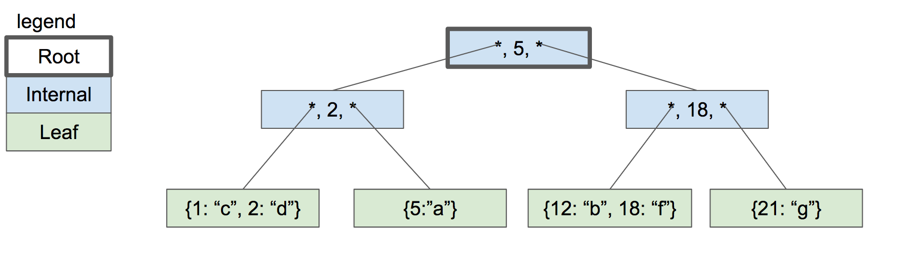

# B-树简介

B-Tree是SQLite用来表示表和索引的数据结构，所以这是一个非常核心的思想。本文将只介绍数据结构，因此它不会有任何代码。

为什么树是数据库的良好数据结构？

- 搜索特定值很快（对数时间）
- 插入/删除您已经找到的值很快（重新平衡的时间不变）
- 遍历一系列值的速度很快（与哈希映射不同）

B-树不同于二叉树（“B”可能代表发明者的名字，但也可以代表“平衡”）。下面是一个示例 B-树：

与二叉树不同，B树中的每个节点可以有2个以上的子节点。每个节点最多可以有 m 个子节点，其中 m 称为树的“秩”。为了保持树的平衡，我们还说节点必须至少有 m/2 个子节点（四舍五入）。

特殊情况除外：

- 叶节点有 0 个子节点
- 根节点可以少于 m 个子节点，但必须至少具有 2 个
- 如果根节点是叶节点（唯一的节点），则它仍有 0 个子节点

上面的图片是一个B-树，SQLite用它来存储索引。为了存储表，SQLites 使用一种称为 B+ 树的变体。

||B-树|B+树|
|----|-----|----|
|Used to store 用于存储|Indexes 索引|	Tables 表|
|内部节点存储密钥|	Yes|	Yes|
|Internal nodes store values内部节点存储值|	Yes|	No|
|Number of children per node 每个节点的子节点数|	 较少| 较多|
|Internal nodes vs. leaf nodes内部节点与叶节点|	Same structure 相同的结构	|Different structure 不同的结构|

在我们开始实现索引之前，将只讨论 B+ 树，但我们将其当作 B-树或 btree来看待。

具有子节点的节点称为“内部”节点。内部节点和叶节点的结构不同：

|For an order-m tree…对于 m 阶树...|	Internal Node 内部节点|	Leaf Node 叶节点|
|-------------|------------|------------|
|Stores 存储|	keys and pointers to children指向孩子和指针|keys and values 键和值|
|Number of keys 键数|	up to m-1 高达 m-1|	as many as will fit 尽可能多|
|Number of pointers 指针数	|number of keys + 键数 + 1	|none 没有|
|Number of values 值数|	none 没有	|number of keys 键数|
|Key purpose 主要目的|	used for routing 用于路由|	paired with value 查找值|
|Stores values? 存储值？|	No	|Yes|

我们通过一个例子来了解 B-树在插入元素时是如何生长的。为了简单起见，树的秩为 3。这意味着：

- 每个内部节点最多 3 个子节点
- 每个内部节点最多 2 个key
- 每个内部节点至少 2 个子节点
- 每个内部节点至少 1 个key

一个空的 B 树只有一个节点：根节点。根节点作为具有零键/值对的叶节点启动：

如果我们插入几个键/值对，它们将按排序顺序存储在叶节点中。

假设叶节点的容量是两个键/值对。当我们插入另一个节点时，我们必须拆分叶节点并将一半的键/值对放在每个节点中。这两个节点都成为新内部节点的子节点，该节点现在将成为根节点。

内部节点有 1 个键和 2 个指向子节点的指针。如果我们想查找小于或等于 5 的键，我们会查找左子树。如果我们想查找大于 5 的键，我们会查找右子树。

现在让我们插入键“2”。首先，我们查找它所在的叶节点（如果存在），然后到达左叶节点。 节点已满，因此我们分割叶子节点并在父节点中创建一个新节点。

让我们继续添加key18和21。我们到了必须再次拆分的地步，但父节点中没有空间容纳21。

解决方案是将根节点拆分为两个内部节点，然后创建新的根节点作为其父节点。

只有当我们拆分根节点时，树的深度才会增加。每个叶节点具有相同的深度和接近相同数量的键/值对，因此树保持平衡并快速搜索。

我们暂时不讨论从树中删除键，删除键将在我们实现插入之后实现。

当我们实现B-树时，每个节点将对应一个页面。根节点将存在于第 0 页中。子指针只是包含子节点的页码。