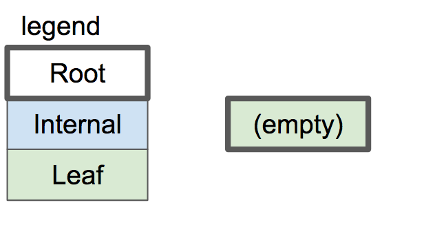

# B-树叶节点的格式

我们正在将表的格式从未排序的行数组更改为 B-树。这是一个相当大的变化，需要多篇文章来实现。在本文结束时，我们将定义叶节点的布局，并支持将键/值对插入到单节点树中。但首先，让我们回顾一下切换到树结构的原因。


## 替换原有表格存储方式

使用当前格式，每个页面仅存储行（没有元数据），因此非常节省空间。插入也很快，因为我们只是附加到末尾。但是，只能通过扫描整个表来查找特定行。如果我们想删除一行，我们必须通过移动它后面的每一行来填补这个洞。

如果我们将表存储为数组，但保持行按 id 排序，我们可以使用二叉搜索来查找特定的 id。但是，插入会很慢，因为我们必须移动大量行才能腾出空间。

相反，我们将采用树结构。树中的每个节点可以包含可变数量的行，因此我们必须在每个节点中存储一些信息以跟踪它包含多少行。此外，还有所有不存储任何行的内部节点的存储开销。为了换取更大的数据库文件，我们可以快速插入、删除和查找。

||Unsorted Array of rows未排序的行数组	| Sorted Array of rows行的排序数组|	Tree of nodes 节点树|
|-----|--------|-----------|--------|
|Pages contain 页面包含|	only data 仅数据|	only data 仅数据|	metadata, primary keys, and data元数据、主键和数据|
|Rows per page 每页行数	|more 更多|	more 更多	|fewer 少|
|Insertion 插入|	O(1) |	O(n) |	O(log(n))| 
|Deletion 删除|	O(n) |	O(n) |	O(log(n))| 
|Lookup by id  按 id 查找|	O(n) |	O(log(n)) |	O(log(n))| 

## 节点头

叶节点和内部节点具有不同的布局。让我们创建一个枚举来跟踪节点类型：

```c
+typedef enum { 
    NODE_INTERNAL, 
    NODE_LEAF 
} NodeType;
```

每个节点将对应于一个页面。内部节点将通过存储子节点的页码来指向其子节点，对应的页码存放着子节点。btree 要求寻址器提供特定的页码，并返回页面缓存中的指针。页按页码顺序一个接一个地存储在数据库文件中。

节点需要在页面开头的标头中存储一些元数据。每个节点都将存储它是什么类型的节点，无论它是否是根节点，以及指向其父节点的指针（以允许查找节点的同级节点）。我为每个标头字段的大小和偏移量定义了常量：

```c
+/*
+ * Common Node Header Layout
+ */
+const uint32_t NODE_TYPE_SIZE = sizeof(uint8_t);
+const uint32_t NODE_TYPE_OFFSET = 0;
+const uint32_t IS_ROOT_SIZE = sizeof(uint8_t);
+const uint32_t IS_ROOT_OFFSET = NODE_TYPE_SIZE;
+const uint32_t PARENT_POINTER_SIZE = sizeof(uint32_t);
+const uint32_t PARENT_POINTER_OFFSET = IS_ROOT_OFFSET + IS_ROOT_SIZE;
+const uint8_t COMMON_NODE_HEADER_SIZE =
+    NODE_TYPE_SIZE + IS_ROOT_SIZE + PARENT_POINTER_SIZE;
```

## 叶节点格式

除了这些常见的通用字段之外，叶节点还需要存储它们包含多少“单元格”。单元格是键/值对。

```c
+/*
+ * Leaf Node Header Layout
+ */
+const uint32_t LEAF_NODE_NUM_CELLS_SIZE = sizeof(uint32_t);
+const uint32_t LEAF_NODE_NUM_CELLS_OFFSET = COMMON_NODE_HEADER_SIZE;
+const uint32_t LEAF_NODE_HEADER_SIZE =
+    COMMON_NODE_HEADER_SIZE + LEAF_NODE_NUM_CELLS_SIZE;
```

叶节点的主体是一个单元格数组。每个单元格都是一个键，后跟一个值（序列化行）。

```c
+/*
+ * Leaf Node Body Layout
+ */
+const uint32_t LEAF_NODE_KEY_SIZE = sizeof(uint32_t);
+const uint32_t LEAF_NODE_KEY_OFFSET = 0;
+const uint32_t LEAF_NODE_VALUE_SIZE = ROW_SIZE;
+const uint32_t LEAF_NODE_VALUE_OFFSET =
+    LEAF_NODE_KEY_OFFSET + LEAF_NODE_KEY_SIZE;
+const uint32_t LEAF_NODE_CELL_SIZE = LEAF_NODE_KEY_SIZE + LEAF_NODE_VALUE_SIZE;
+const uint32_t LEAF_NODE_SPACE_FOR_CELLS = PAGE_SIZE - LEAF_NODE_HEADER_SIZE;
+const uint32_t LEAF_NODE_MAX_CELLS =
+    LEAF_NODE_SPACE_FOR_CELLS / LEAF_NODE_CELL_SIZE;
```

基于这些常量，以下是叶节点当前布局的样子：


在标头中使用每个布尔值的整个字节有点低效，但这样可以更轻松地编写代码来访问这些值。

另请注意，最后有一些浪费的空间。我们在节点首部之后存储尽可能多的单元格，但剩余的空间无法容纳整个单元格。我们将其留空以避免在节点之间拆分单元格。

## 访问叶节点字段

访问键、值和元数据的代码都涉及使用我们刚刚定义的常量的指针算法。

```c
+uint32_t* leaf_node_num_cells(void* node) {
+  return node + LEAF_NODE_NUM_CELLS_OFFSET;
+}
+
+void* leaf_node_cell(void* node, uint32_t cell_num) {
+  return node + LEAF_NODE_HEADER_SIZE + cell_num * LEAF_NODE_CELL_SIZE;
+}
+
+uint32_t* leaf_node_key(void* node, uint32_t cell_num) {
+  return leaf_node_cell(node, cell_num);
+}
+
+void* leaf_node_value(void* node, uint32_t cell_num) {
+  return leaf_node_cell(node, cell_num) + LEAF_NODE_KEY_SIZE;
+}
+
+void initialize_leaf_node(void* node) { 
    *leaf_node_num_cells(node) = 0; 
}
+
```

这些方法返回指向相关值的指针，因此它们可以用作 getter 和 setter。

## 修改寻址器和表对象

每个节点将只占用一页，即使它没有满。这意味着我们的寻址器不再需要支持读取/写入部分页面。

```c
-void pager_flush(Pager* pager, uint32_t page_num, uint32_t size) {
+void pager_flush(Pager* pager, uint32_t page_num) {
   if (pager->pages[page_num] == NULL) {
     printf("Tried to flush null page\n");
     exit(EXIT_FAILURE);
@@ -242,7 +337,7 @@ void pager_flush(Pager* pager, uint32_t page_num, uint32_t size) {
   }
 
   ssize_t bytes_written =
-      write(pager->file_descriptor, pager->pages[page_num], size);
+      write(pager->file_descriptor, pager->pages[page_num], PAGE_SIZE);
 
   if (bytes_written == -1) {
     printf("Error writing: %d\n", errno);
```

```c
void db_close(Table* table) {
   Pager* pager = table->pager;
-  uint32_t num_full_pages = table->num_rows / ROWS_PER_PAGE;
 
-  for (uint32_t i = 0; i < num_full_pages; i++) {
+  for (uint32_t i = 0; i < pager->num_pages; i++) {
     if (pager->pages[i] == NULL) {
       continue;
     }
-    pager_flush(pager, i, PAGE_SIZE);
+    pager_flush(pager, i);
     free(pager->pages[i]);
     pager->pages[i] = NULL;
   }
 
-  // There may be a partial page to write to the end of the file
-  // This should not be needed after we switch to a B-tree
-  uint32_t num_additional_rows = table->num_rows % ROWS_PER_PAGE;
-  if (num_additional_rows > 0) {
-    uint32_t page_num = num_full_pages;
-    if (pager->pages[page_num] != NULL) {
-      pager_flush(pager, page_num, num_additional_rows * ROW_SIZE);
-      free(pager->pages[page_num]);
-      pager->pages[page_num] = NULL;
-    }
-  }
-
   int result = close(pager->file_descriptor);
   if (result == -1) {
     printf("Error closing db file.\n");
```

现在，在我们的数据库中存储页数而不是行数更有意义。页数应与 pager 对象相关联，而不是与表相关联，因为它是数据库使用的页数，而不是特定表。btree 由其根节点页码标识，因此表对象需要跟踪该页码。

```c
 const uint32_t PAGE_SIZE = 4096;
 const uint32_t TABLE_MAX_PAGES = 100;
-const uint32_t ROWS_PER_PAGE = PAGE_SIZE / ROW_SIZE;
-const uint32_t TABLE_MAX_ROWS = ROWS_PER_PAGE * TABLE_MAX_PAGES;
 
 typedef struct {
   int file_descriptor;
   uint32_t file_length;
+  uint32_t num_pages;
   void* pages[TABLE_MAX_PAGES];
 } Pager;
 
 typedef struct {
   Pager* pager;
-  uint32_t num_rows;
+  uint32_t root_page_num;
 } Table;
```

```c
@@ -127,6 +200,10 @@ void* get_page(Pager* pager, uint32_t page_num) {
     }
 
     pager->pages[page_num] = page;
+
+    if (page_num >= pager->num_pages) {
+      pager->num_pages = page_num + 1;
+    }
   }
 
   return pager->pages[page_num];
```

```c
@@ -184,6 +269,12 @@ Pager* pager_open(const char* filename) {
   Pager* pager = malloc(sizeof(Pager));
   pager->file_descriptor = fd;
   pager->file_length = file_length;
+  pager->num_pages = (file_length / PAGE_SIZE);
+
+  if (file_length % PAGE_SIZE != 0) {
+    printf("Db file is not a whole number of pages. Corrupt file.\n");
+    exit(EXIT_FAILURE);
+  }
 
   for (uint32_t i = 0; i < TABLE_MAX_PAGES; i++) {
     pager->pages[i] = NULL;
```

## 修改游标

游标表示表中的位置。当我们的表是一个简单的行数组时，我们可以只在给定行号的情况下访问一行。现在它是一棵树，我们通过节点的页码和该节点内的单元格编号来识别位置。

```c
 typedef struct {
   Table* table;
-  uint32_t row_num;
+  uint32_t page_num;
+  uint32_t cell_num;
   bool end_of_table;  // Indicates a position one past the last element
 } Cursor;
```

```c
Cursor* table_start(Table* table) {
   Cursor* cursor = malloc(sizeof(Cursor));
   cursor->table = table;
-  cursor->row_num = 0;
-  cursor->end_of_table = (table->num_rows == 0);
+  cursor->page_num = table->root_page_num;
+  cursor->cell_num = 0;
+
+  void* root_node = get_page(table->pager, table->root_page_num);
+  uint32_t num_cells = *leaf_node_num_cells(root_node);
+  cursor->end_of_table = (num_cells == 0);
 
   return cursor;
 }
```

```c
Cursor* table_end(Table* table) {
   Cursor* cursor = malloc(sizeof(Cursor));
   cursor->table = table;
-  cursor->row_num = table->num_rows;
+  cursor->page_num = table->root_page_num;
+
+  void* root_node = get_page(table->pager, table->root_page_num);
+  uint32_t num_cells = *leaf_node_num_cells(root_node);
+  cursor->cell_num = num_cells;
   cursor->end_of_table = true;
 
   return cursor;
 }
```

```c
void* cursor_value(Cursor* cursor) {
-  uint32_t row_num = cursor->row_num;
-  uint32_t page_num = row_num / ROWS_PER_PAGE;
+  uint32_t page_num = cursor->page_num;
   void* page = get_page(cursor->table->pager, page_num);
-  uint32_t row_offset = row_num % ROWS_PER_PAGE;
-  uint32_t byte_offset = row_offset * ROW_SIZE;
-  return page + byte_offset;
+  return leaf_node_value(page, cursor->cell_num);
 }
```

```c
 void cursor_advance(Cursor* cursor) {
-  cursor->row_num += 1;
-  if (cursor->row_num >= cursor->table->num_rows) {
+  uint32_t page_num = cursor->page_num;
+  void* node = get_page(cursor->table->pager, page_num);
+
+  cursor->cell_num += 1;
+  if (cursor->cell_num >= (*leaf_node_num_cells(node))) {
     cursor->end_of_table = true;
   }
 }
```

## 插入到叶节点

在本文中，我们只实现足够的功能来获取单节点树。回想一下上一篇文章，树开始时是一个空的叶节点：



可以添加键/值对，直到叶节点达到最大能存放节点数。


当我们第一次打开数据库时，数据库文件将为空，因此我们将第 0 页初始化为空叶节点（根节点）：

```c
Table* db_open(const char* filename) {
   Pager* pager = pager_open(filename);
-  uint32_t num_rows = pager->file_length / ROW_SIZE;
 
   Table* table = malloc(sizeof(Table));
   table->pager = pager;
-  table->num_rows = num_rows;
+  table->root_page_num = 0;
+
+  if (pager->num_pages == 0) {
+    // New database file. Initialize page 0 as leaf node.
+    void* root_node = get_page(pager, 0);
+    initialize_leaf_node(root_node);
+  }
 
   return table;
 }
```

接下来，我们将创建一个函数，用于将键/值对插入叶节点。它将以游标作为输入来表示应插入该对的位置。

```c
+void leaf_node_insert(Cursor* cursor, uint32_t key, Row* value) {
+  void* node = get_page(cursor->table->pager, cursor->page_num);
+
+  uint32_t num_cells = *leaf_node_num_cells(node);
+  if (num_cells >= LEAF_NODE_MAX_CELLS) {
+    // Node full
+    printf("Need to implement splitting a leaf node.\n");
+    exit(EXIT_FAILURE);
+  }
+
+  if (cursor->cell_num < num_cells) {
+    // Make room for new cell
+    for (uint32_t i = num_cells; i > cursor->cell_num; i--) {
+      memcpy(leaf_node_cell(node, i), leaf_node_cell(node, i - 1),
+             LEAF_NODE_CELL_SIZE);
+    }
+  }
+
+  *(leaf_node_num_cells(node)) += 1;
+  *(leaf_node_key(node, cursor->cell_num)) = key;
+  serialize_row(value, leaf_node_value(node, cursor->cell_num));
+}
+
```

我们还没有实现拆分，所以如果节点已满，我们会出错。接下来，我们将单元格向右移动一个空格，为新单元格腾出空间。然后我们将新的键/值写入空白空间。

由于我们假设树只有一个节点，我们的 execute_insert() 函数只需要调用这个辅助方法：

```c
 ExecuteResult execute_insert(Statement* statement, Table* table) {
-  if (table->num_rows >= TABLE_MAX_ROWS) {
+  void* node = get_page(table->pager, table->root_page_num);
+  if ((*leaf_node_num_cells(node) >= LEAF_NODE_MAX_CELLS)) {
     return EXECUTE_TABLE_FULL;
   }
 
   Row* row_to_insert = &(statement->row_to_insert);
   Cursor* cursor = table_end(table);
 
-  serialize_row(row_to_insert, cursor_value(cursor));
-  table->num_rows += 1;
+  leaf_node_insert(cursor, row_to_insert->id, row_to_insert);
 
   free(cursor);
```

通过这些更改，我们的数据库应该像以前一样工作！除了现在它更快地返回“表已满”错误，因为我们还不能拆分根节点。

## 打印常量的命令

我正在添加一个新的元命令来打印出一些感兴趣的常量。

```c
+void print_constants() {
+  printf("ROW_SIZE: %d\n", ROW_SIZE);
+  printf("COMMON_NODE_HEADER_SIZE: %d\n", COMMON_NODE_HEADER_SIZE);
+  printf("LEAF_NODE_HEADER_SIZE: %d\n", LEAF_NODE_HEADER_SIZE);
+  printf("LEAF_NODE_CELL_SIZE: %d\n", LEAF_NODE_CELL_SIZE);
+  printf("LEAF_NODE_SPACE_FOR_CELLS: %d\n", LEAF_NODE_SPACE_FOR_CELLS);
+  printf("LEAF_NODE_MAX_CELLS: %d\n", LEAF_NODE_MAX_CELLS);
+}
+
@@ -294,6 +376,14 @@ MetaCommandResult do_meta_command(InputBuffer* input_buffer, Table* table) {
   if (strcmp(input_buffer->buffer, ".exit") == 0) {
     db_close(table);
     exit(EXIT_SUCCESS);
+  } else if (strcmp(input_buffer->buffer, ".constants") == 0) {
+    printf("Constants:\n");
+    print_constants();
+    return META_COMMAND_SUCCESS;
   } else {
     return META_COMMAND_UNRECOGNIZED_COMMAND;
   }
```

## 树可视化

为了帮助调试和可视化，我还添加了一个元命令来打印出 btree 的表示形式。

```c
+void print_leaf_node(void* node) {
+  uint32_t num_cells = *leaf_node_num_cells(node);
+  printf("leaf (size %d)\n", num_cells);
+  for (uint32_t i = 0; i < num_cells; i++) {
+    uint32_t key = *leaf_node_key(node, i);
+    printf("  - %d : %d\n", i, key);
+  }
+}
+
```

```c
@@ -294,6 +376,14 @@ MetaCommandResult do_meta_command(InputBuffer* input_buffer, Table* table) {
   if (strcmp(input_buffer->buffer, ".exit") == 0) {
     db_close(table);
     exit(EXIT_SUCCESS);
+  } else if (strcmp(input_buffer->buffer, ".btree") == 0) {
+    printf("Tree:\n");
+    print_leaf_node(get_page(table->pager, 0));
+    return META_COMMAND_SUCCESS;
   } else if (strcmp(input_buffer->buffer, ".constants") == 0) {
     printf("Constants:\n");
     print_constants();
     return META_COMMAND_SUCCESS;
   } else {
     return META_COMMAND_UNRECOGNIZED_COMMAND;
   }
```

执行结果如下所示：

```shell
PS D:\code\db021\code> .\db.exe
[warnning] maybe you need supply a database filename,we would use "mydb.db".
db > insert 1 test test@qq.com
Executed.
db > select
(1, test, test@qq.com)
Executed.
db > .btree
Tree:
leaf (size 1)
  - 0 : 1
db > .constants
Constants:
ROW_SIZE: 293
COMMON_NODE_HEADER_SIZE: 6
LEAF_NODE_HEADER_SIZE: 10
LEAF_NODE_CELL_SIZE: 297
LEAF_NODE_SPACE_FOR_CELLS: 4086
LEAF_NODE_MAX_CELLS: 13
db > 
```

另外需要注意的是，在本次修改中，将各个模块都提取出来作为单独的文件，通过.h文件就行交互，而不是整体放在一个.c文件里。代码具体分为如下几个部分：

- btree
- command
- cursor
- execute
- pager
- row
- table
- main